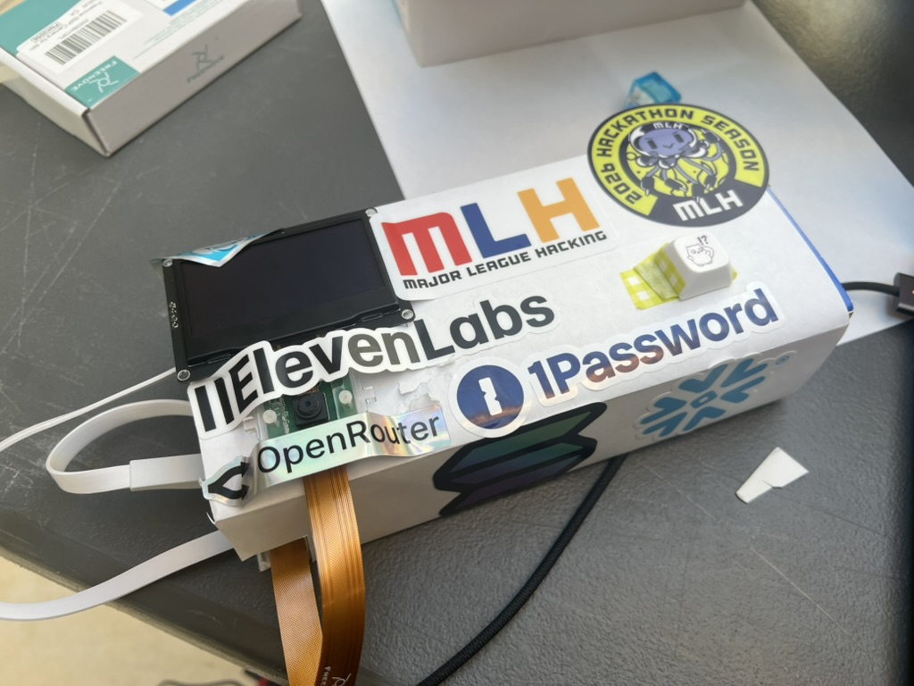
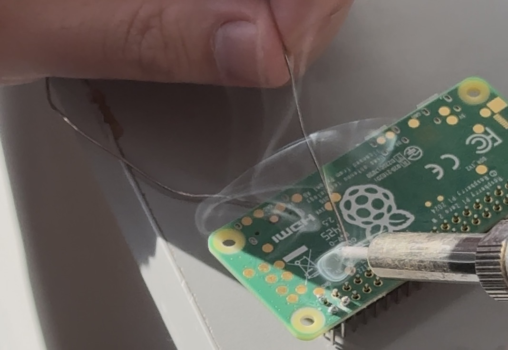
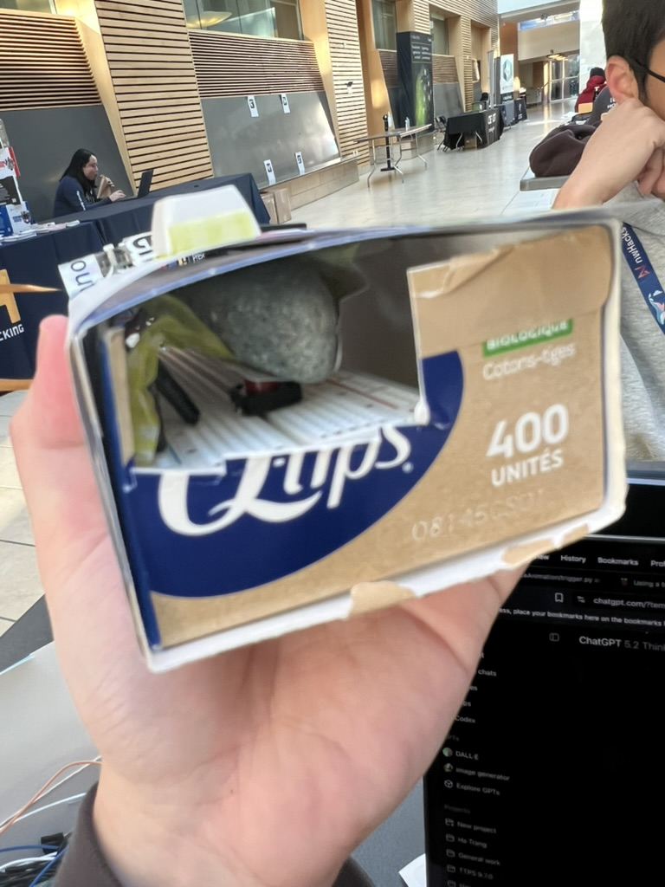

## Sorty

Project page: [Sorty on Devpost](https://devpost.com/software/sorty-25gdrx?ref_content=my-projects-tab&ref_feature=my_projects)

## Demo
Demo video: [YouTube Demo](https://www.youtube.com/watch?v=6I_pTN3uTkg)

## Inspiration
As international students, we found trash sorting completely unfamiliar when we first arrived in Canada. Standing in front of multiple bins with a half-finished drink or a food container, we often found ourselves confused. Is this plastic? Compost? Or just waste? That moment of hesitation happened almost every day.

Sorty was created to solve this exact problem. We wanted to build something that could guide people, especially newcomers, toward making the right decision while promoting sustainable habits in a simple and friendly way.

## What it does
Sorty is a smart trash-sorting assistant built using a Raspberry Pi Zero 2 W, a 2.6" OLED display, and a 5MP Pi camera. When the user presses a button, Sorty captures an image of the item and uses AI to suggest which bin it belongs to. The result is displayed instantly on the screen, making waste sorting fast, intuitive, and less stressful.

## Challenges we ran into
This hackathon pushed us far outside our comfort zone. For one of us, this was his first-ever hackathon. For the other, it was only a third. On top of that, neither of us had any prior experience with hardware.

We spent much of our time learning how to wire components, debug drivers, search through scattered documentation, and watch YouTube tutorials. We also learned how to solder for the first time, which caused more problems than we expected. What we initially thought were wiring mistakes turned out to be soldering issues, forcing us to redo parts of the build while racing against time.

With limited resources, we had to improvise constantly. When we ran out of tape, we used stickers. When the button did not fit properly, we placed a stone inside the enclosure to fill the gap. These improvised solutions were not elegant, but they worked.

On the software side, we ran into compatibility issues where Python libraries required sudo, but sudo and our virtual environment were using different Python versions. This caused unexpected failures with the button and other libraries and took significant time to diagnose and fix.

## What we learned
The biggest thing we learned was how to manage time and adapt quickly. With only two people, we had to make fast decisions about what mattered most and constantly adjust our plan as things broke or took longer than expected.

We also had to learn a completely new coding approach. Since we didn’t have a monitor, everything was done through SSH, editing files directly in the terminal using nano. Debugging and testing without a visual interface was slow at first, but we got better at it as the hackathon went on.

On top of that, neither of us had worked with hardware before. We had to pick up soldering, wiring, and system-level debugging on the fly. This experience taught us how to learn quickly, communicate clearly, and keep moving forward even when we were unsure.

Overall, the hackathon pushed us to be more flexible, take initiative, and trust each other under pressure.

## What's next for Sorty
We imagine Sorty being used across the UBC campus to help students confidently sort their trash. At the very least, it will be making an appearance in our own home, where the confusion that inspired this project began. In the future, we would like to add a built-in speaker to provide audio guidance for visually impaired users. Instead of relying on a button, Sorty could continuously monitor when an item is brought close to the device and respond automatically, making the interaction faster and more intuitive. We also see strong potential for deploying Sorty in places like airports, where cultural differences are often encountered first, helping people learn local waste-sorting rules immediately upon arrival.
